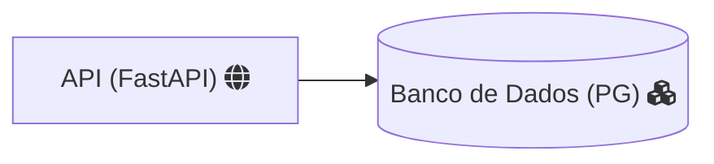

# langs-test-loop
Loop performance test with 1 million cycles in programming languages

---

# Recursos
- FastAPI
- Banco de Dados 

---

Test performed in: 
+ C
+ C++
+ Java
+ Python
+ Ruby
+ PHP
+ Go
+ JavaScript
+ Rust
+ Bash
+ C#
+ Elixir
+ Julia
+ Lua
+ Nim
+ Perl
+ R
+ Swift
+ V
+ Vala
+ Clojure
+ Dart
+ Dlang
+ Haskell
+ Kotlin
+ Ocaml
+ Powershell
+ Scala
+ Typescript
+ Zig

---

In the videos: [First video](https://youtu.be/spLIBqiv2Og), [Second video](https://youtu.be/KbWIFxUqjfc) and [Third video](https://youtu.be/M1CCb3XFccQ) .
